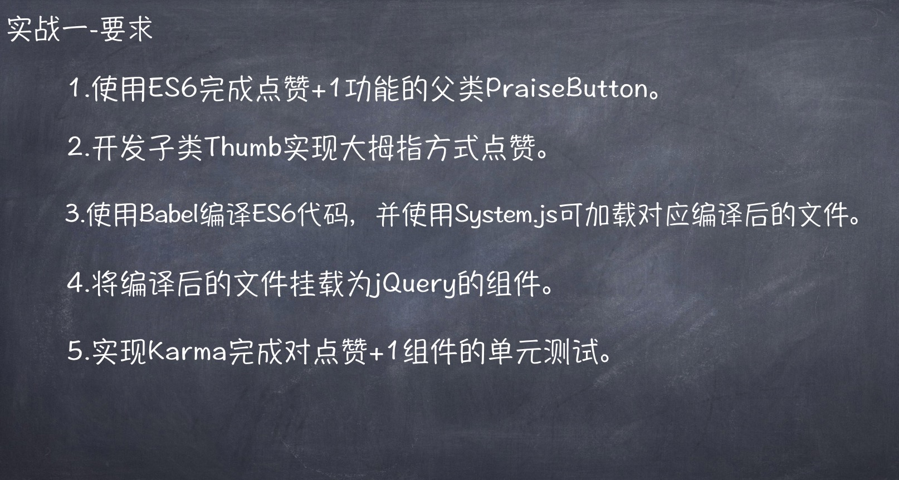

# 第一周



# 安装

```shell
$ git clone https://github.com/fireflylight66/yideng_homework.git
$ npm i

// 无头浏览器
$ brew install phantomjs

// 简易server
$ npm i -g serve
```

# 单元测试

```shell
$ npm test
```

# 使用

```shell
// 构建文件
$ npm run build

// 启动server
$ serve -s public
```